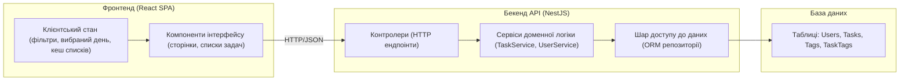

# Архітектура застосунку Cascade

## 1. Призначення системи

Cascade — це веб-застосунок для планування щоденних, тижневих та довгострокових завдань.  
Користувач може створювати задачі, групувати їх за днями та тижнями, задавати пріоритети, дедлайни та відстежувати прогрес виконання.

## 2. Загальна архітектура

Архітектура застосунку побудована за моделлю «клієнт–сервер» та складається з трьох основних частин:

- **Фронтенд (React + TypeScript, Vite)** — односторінковий веб-клієнт, який працює в браузері.
- **Бекенд API (Node.js + NestJS)** — HTTP/REST API для роботи з даними завдань та користувачів.
- **База даних (SQL, напр. PostgreSQL)** — зберігання задач, користувачів, тегів та історії оновлень.

Взаємодія компонентів:

## 3. Основні модулі фронтенду

1. **Модуль навігації / shell-застосунку**
   - Відповідає за загальне компонування інтерфейсу: шапка, бокова панель, перемикання між основними розділами (сьогодні, тиждень, календар тощо).

2. **Модуль роботи із задачами (Tasks)**
   - Компоненти для:
     - відображення списку задач за вибраний день/тиждень;
     - створення нової задачі;
     - редагування задачі (назва, опис, статус, дедлайн, пріоритет);
     - зміни статусу (заплановано, в роботі, виконано).
   - Робота з API: завантаження задач (`GET /tasks`), створення (`POST /tasks`), оновлення (`PATCH /tasks/:id`), видалення (`DELETE /tasks/:id`).

3. **Модуль фільтрації та пошуку**
   - Поля фільтрів (за датою, статусом, пріоритетом, тегами).
   - Передача параметрів фільтрації до бекенду через запит типу `GET /tasks?date=&status=&priority=&tag=`.

4. **(Опціонально) Модуль автентифікації**
   - Форма логіну / реєстрації.
   - Зберігання токена доступу.
   - Інтеграція з бекендом (ендпоінти `auth/login`, `auth/register`).

## 4. Основні модулі бекенду

1. **Модуль Tasks**
   - **Контролер `TasksController`**:
     - `GET /tasks` — отримання списку задач з фільтрацією.
     - `GET /tasks/:id` — отримання однієї задачі.
     - `POST /tasks` — створення нової задачі.
     - `PATCH /tasks/:id` — оновлення полів задачі.
     - `DELETE /tasks/:id` — видалення задачі.
   - **Сервіс `TaskService`**:
     - Бізнес-логіка створення, зміни статусу, оновлення дедлайнів.
     - Валідація вхідних даних.
   - **Репозиторій / ORM-шар**:
     - Безпосередня робота з таблицями `Tasks`, `TaskTags`.

2. **Модуль Users (на майбутнє)**
   - Управління профілем користувача.
   - Можливість зберігати налаштування (формат відображення, часовий пояс, типи представлення задач).

3. **Модуль Auth (на майбутнє)**
   - Обробка реєстрації та входу.
   - Видача токенів доступу.
   - Перевірка прав доступу до задач конкретного користувача.

4. **Інфраструктурний модуль БД**
   - Конфігурація підключення до БД.
   - Міграції схеми даних.
   - Ініціалізація ORM.

## 5. Зовнішні залежності

- **Фронтенд**:
  - React, React Router (для маршрутизації).
  - Бібліотека компонентів (опційно).
- **Бекенд**:
  - NestJS (контролери, модулі, DI).
  - ORM (Prisma / TypeORM) для доступу до БД.
- **Інфраструктура**:
  - Docker / docker-compose для локального розгортання БД та серверу.
  - GitHub Actions — для CI/CD (використовується в наступних лабораторних роботах).
