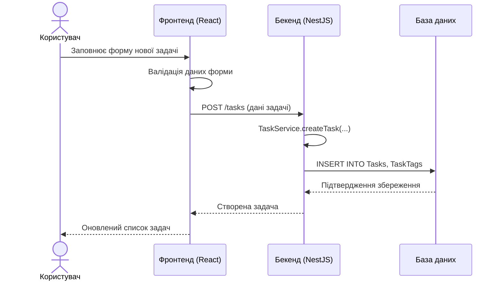
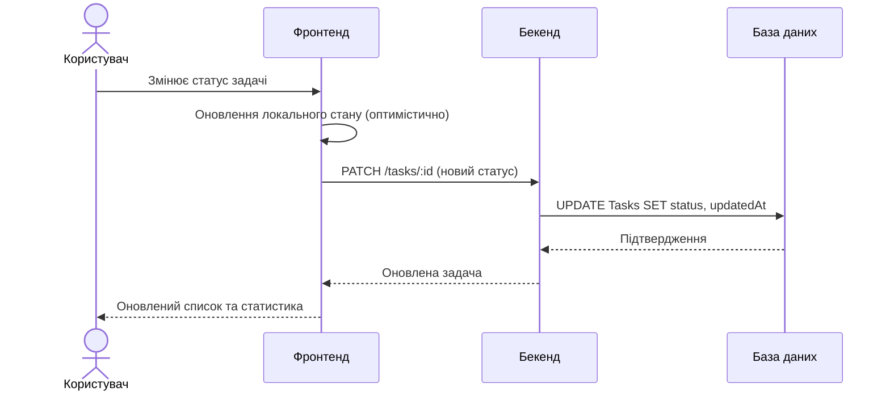

# Оновлення та зміна даних у ключових сценаріях

## 1. Ключові сценарії використання

Основні сценарії роботи користувача із застосунком Cascade:

1. Створення нової задачі.
2. Зміна статусу задачі (наприклад, з `planned` на `in_progress` або `done`).
3. Редагування задачі (оновлення заголовка, опису, дедлайну, пріоритету, тегів).
4. Видалення задачі.
5. Перегляд та фільтрація задач за днем, тижнем, статусом, тегами.

У подальших лабораторних роботах ці сценарії будуть реалізовані спочатку на статичних даних (ЛР3), а потім з використанням бази даних (ЛР4).

## 2. Створення нової задачі

### 2.1. Послідовність дій

1. Користувач відкриває інтерфейс списку задач (наприклад, на поточний день).
2. У фронтенді користувач натискає кнопку «Додати задачу» та заповнює форму:
   - заголовок;
   - опис (опційно);
   - пріоритет;
   - дата (день/тиждень);
   - дедлайн (опційно);
   - теги.
3. Фронтенд виконує базову валідацію форми (обов’язкові поля, формат дати).
4. Фронтенд надсилає HTTP-запит `POST /tasks` до бекенду з даними форми.
5. Бекенд:
   - перевіряє права доступу (користувач автентифікований);
   - викликає `TaskService.createTask(...)`;
   - сервіс формує модель задачі, встановлює початковий статус `planned`, заповнює `createdAt` та `updatedAt`;
   - репозиторій зберігає новий запис у таблиці `Tasks` і зв’язки у `TaskTags`.
6. Бекенд повертає у відповідь створену задачу.
7. Фронтенд додає задачу до локального списку та оновлює інтерфейс.

### 2.2. Діаграма послідовності

## 3. Зміна статусу задачі

### 3.1. Послідовність дій

1. Користувач у списку задач змінює статус задачі (наприклад, перемикає чекбокс «Виконано»).
2. Фронтенд:
   - оновлює локальний стан (оптимістичне оновлення);
   - надсилає запит `PATCH /tasks/:id` з новим статусом.
3. Бекенд:
   - перевіряє, що задача належить поточному користувачу;
   - оновлює поле `status` та `updatedAt` у таблиці `Tasks`.
4. Бекенд повертає оновлену задачу.
5. Фронтенд:
   - за потреби синхронізує локальний стан з відповіддю;
   - оновлює агреговані показники (наприклад, кількість виконаних задач за день).

### 3.2. Діаграма послідовності

## 4. Редагування та видалення задач

### 4.1. Редагування задачі

- Фронтенд надсилає `PATCH /tasks/:id` з оновленими полями (заголовок, опис, дедлайн, пріоритет, список тегів).
- Бекенд:
  - оновлює відповідні поля у `Tasks`;
  - оновлює зв’язки у таблиці `TaskTags`;
  - перераховує агрегати, якщо вони залежать від змінених полів (наприклад, дедлайн).

### 4.2. Видалення задачі

- Фронтенд надсилає `DELETE /tasks/:id`.
- Бекенд видаляє запис з `Tasks` та відповідні записи з `TaskTags`.
- Фронтенд оновлює відображення (видаляє задачу зі списку, оновлює кількість задач).

## 5. Перегляд та фільтрація задач

1. Користувач вибирає період (день, тиждень, місяць) та додаткові фільтри (статус, тег, пріоритет).
2. Фронтенд формує запит `GET /tasks` з параметрами:
   - `from`, `to` — діапазон дат;
   - `status` — бажаний статус (або декілька);
   - `tag` — ідентифікатор тегу (за потреби).
3. Бекенд:
   - формує SQL-запит з урахуванням усіх фільтрів;
   - повертає список задач, відсортований за датою / пріоритетом.
4. Фронтенд:
   - відображає список задач;
   - рахує агрегати (наприклад, кількість виконаних задач, прогрес за день / тиждень).

Таким чином, модель даних та архітектура застосунку підтримують увесь життєвий цикл задач: створення, оновлення, перегляд, фільтрацію та видалення.
