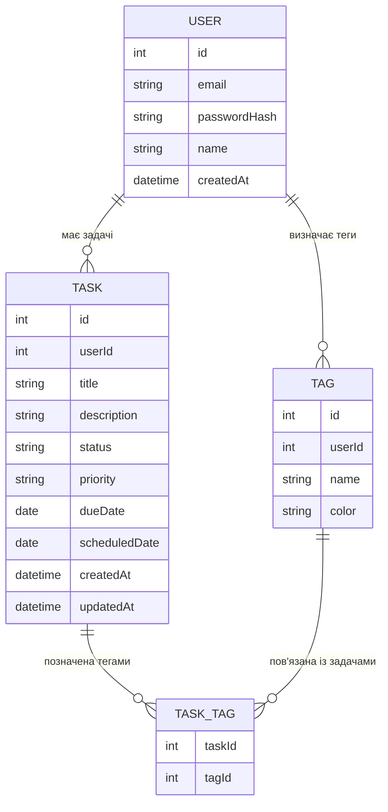

# Модель даних Cascade

Ця модель даних побудована зверху вниз: від користувача та його облікового запису — до конкретних задач, а потім до механізмів їх групування та класифікації.

---

## 1. Загальна структура моделі

Логіка побудови моделі:

1. **Рівень користувача** — хто працює із застосунком.
2. **Рівень задач** — що саме планує та виконує користувач.
3. **Рівень класифікації** — як задачі групуються та фільтруються (теги, зв’язки, агрегати).

У спрощеному вигляді це можна показати так:

```text
Користувач (User)
    └─ має багато задач (Tasks)
            └─ кожна задача може мати нуль або більше тегів (Tags)
                    └─ зв'язок "багато-до-багатьох" реалізується через TaskTag
```

---

## 2. Рівень користувача

### 2.1. User (Користувач)

Користувач — це власник усіх задач та пов’язаних із ними тегів. У перспективі саме з цією сутністю пов’язується автентифікація та налаштування профілю.

Основні атрибути:

- `id` — унікальний ідентифікатор користувача.
- `email` — електронна пошта (логін).
- `passwordHash` — хеш пароля.
- `name` — відображуване ім’я.
- `createdAt` — дата реєстрації.

Кожен користувач має власний простір задач і тегів: задачі та теги двох різних користувачів логічно не перетинаються.

---

## 3. Рівень задач

### 3.1. Task (Задача)

Задача описує конкретну дію або робочий елемент, який користувач планує виконати.

Основні атрибути:

- `id` — унікальний ідентифікатор задачі.
- `userId` — посилання на користувача (власника задачі).
- `title` — короткий заголовок задачі.
- `description` — детальний опис (опційно).
- `status` — стан задачі:
  - `planned` — заплановано;
  - `in_progress` — у процесі;
  - `done` — виконано.
- `priority` — пріоритет (наприклад, `low`, `medium`, `high`).
- `dueDate` — дедлайн (опційно, крайній термін виконання).
- `scheduledDate` — дата, для якої задача планується в інтерфейсі (поточний день, конкретний день тижня тощо).
- `createdAt` — дата створення.
- `updatedAt` — дата останнього оновлення.

Через такі атрибути, як `status`, `priority`, `dueDate` та `scheduledDate`, система може будувати корисні агрегати: прогрес за день, список прострочених задач, завантаженість користувача тощо.

---

## 4. Рівень класифікації задач

### 4.1. Tag (Тег)

Тег використовується для логічного групування задач за темами, напрямками роботи або проєктами.

Основні атрибути:

- `id` — унікальний ідентифікатор тегу.
- `userId` — посилання на користувача, якому належить тег (кожен користувач має свій власний набір тегів).
- `name` — назва тегу (наприклад, `університет`, `робота`, `особисте`).
- `color` — колір для відображення тегу в інтерфейсі (опційно).

Теги допомагають швидко відфільтрувати задачі за контекстом (типом активності, проєктом, предметом тощо).

### 4.2. TaskTag (зв’язуюча таблиця)

Оскільки одна задача може мати декілька тегів, а один тег може застосовуватись до багатьох задач, зв’язок між `Task` та `Tag` реалізується через окрему таблицю `TaskTag`.

Основні атрибути:

- `taskId` — посилання на задачу.
- `tagId` — посилання на тег.

Ця таблиця зберігає тільки пари ідентифікаторів і не містить додаткових атрибутів, оскільки сама по собі не є окремою доменною сутністю — вона описує зв’язок.

---

## 5. ER-діаграма моделі даних

Нижче наведена ER-діаграма моделі даних у нотації Mermaid.  
Сутності розташовані згори донизу в тому ж порядку, як описані вище: спочатку користувач, потім задачі, потім механізми класифікації.



---

## 6. Агрегація та звітність на основі моделі

На основі цієї моделі можна обчислювати та відображати такі агрегати:

1. **Прогрес виконання задач**:
   - відсоток задач у статусі `done` відносно загальної кількості задач за день / тиждень / місяць;
   - кількість задач у кожному статусі.

2. **Завантаженість користувача**:
   - кількість задач із дедлайном у найближчі дні;
   - кількість прострочених задач (`dueDate` < поточна дата, статус ≠ `done`).

3. **Аналіз за тегами**:
   - скільки задач має кожен тег;
   - які теги найчастіше використовуються;
   - прогрес виконання задач у межах одного тегу (наприклад, окремо по проєкту або предмету).

4. **Аналіз за пріоритетами**:
   - скільки задач з високим пріоритетом залишилося невиконаними;
   - розподіл задач за пріоритетами у вибраний день або тиждень.

Таким чином, модель даних підтримує не лише зберігання задач, а й побудову різних звітів і візуалізацій, які допомагають користувачу планувати навантаження та контролювати прогрес.
